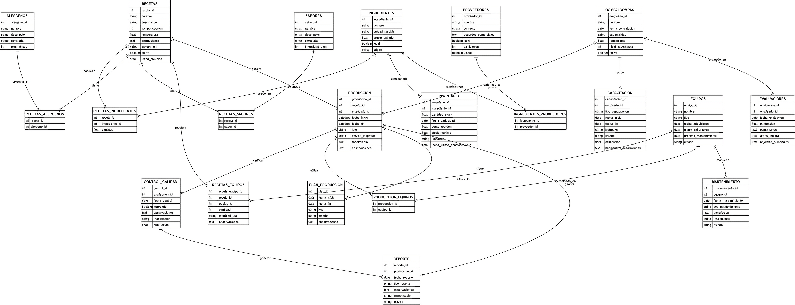

# 🍫 Fábrica de Chocolates Willy Wonka - Sistema de Gestión

Sistema de gestión de base de datos relacional desarrollado para la Fábrica de Chocolates Wonka Digital. Permite administrar **recetas, inventario de ingredientes, producción, empleados (Oompa Loompas), equipos y control de calidad**.

[](https://www.postgresql.org/)
[](https://www.postgresql.org/docs/current/sql.html)
[](https://www.postgresql.org/docs/current/app-psql.html)
[](https://www.postgresql.org/docs/current/app-pgdump.html)
[](https://git-scm.com/)
[](https://github.com/)


---

## 📊 Diagrama Entidad-Relación



> 🖼️ Diagrama completo disponible en [`02-documentacion/diagrama_ER.png`](./02-documentacion/diagrama_ER.png)

---

## 📂 Estructura del Repositorio

```text
sql_proyecto_willy_wonka/
├── 01-scripts-sql/
│   ├── 00_backup_completo_pgdump.sql
│   ├── 01_creacion_estructura.sql
│   ├── 02_insercion_datos.sql
│   └── 03_consultas_ejemplos.sql
├── 02-documentacion/
│   ├── 01_diseno_bbdd.pdf
│   ├── 02_insercion_consulta.pdf
│   ├── 03_caso_estudio_wonka_digital.pdf
│   └── diagrama_ER.png
├── README.md
└── LICENSE
```

---

## 🚀 Cómo restaurar la Base de Datos

### 🔹 Opción Rápida (Backup completo)

Si tienes el archivo `00_backup_completo_pgdump.sql` (generado con `pg_dump`), puedes restaurar todo (estructura + datos) con:

```bash
psql -U tu_usuario -d nombre_base_datos -f 01-scripts-sql/00_backup_completo_pgdump.sql
```

### 🔹 Opción Paso a Paso (Evaluaciones)

**1. Crear la estructura (tablas, índices y vistas):**

```bash
psql -U tu_usuario -d nombre_base_datos -f 01-scripts-sql/01_creacion_estructura.sql
```

**2. Insertar los datos:**

```bash
psql -U tu_usuario -d nombre_base_datos -f 01-scripts-sql/02_insercion_datos.sql
```

**3. (Opcional) Ejecutar las consultas de ejemplo:**

```bash
psql -U tu_usuario -d nombre_base_datos -f 01-scripts-sql/03_consultas_ejemplos.sql
```

> 💡 **Tip:** Reemplaza `tu_usuario` y `nombre_base_datos` por tus credenciales reales de PostgreSQL.

---

## 🛠️ Tecnologías y Herramientas

| Componente | Detalle |
|------------|---------|
| 🐘 **Motor de Base de Datos** | PostgreSQL 17+ |
| 📝 **Lenguaje de Consulta** | SQL Estándar (DDL, DML, DQL) |
| ⚙️ **Herramientas Nativas** | `psql` (CLI) y `pg_dump` (Backups) |
| 🗂️ **Control de Versiones** | Git / GitHub |

---

## 📚 Documentación

Toda la documentación formal del proyecto se encuentra en la carpeta [`02-documentacion/`](https://github.com/darwinjcn/sql_proyecto_willy_wonka/tree/main/02-documentacion):

- 📘 **[01_diseno_bbdd.pdf](https://github.com/darwinjcn/sql_proyecto_willy_wonka/blob/main/02-documentacion/01_diseno_bbdd.pdf)** — Modelado, normalización, diccionario de datos y diagramas.
- 📗 **[02_insercion_consulta.pdf](https://github.com/darwinjcn/sql_proyecto_willy_wonka/blob/main/02-documentacion/02_insercion_consulta.pdf)** — Carga masiva de datos, sentencias DML y casos de prueba.
- 📕 **[03_caso_estudio_wonka_digital.pdf](https://github.com/darwinjcn/sql_proyecto_willy_wonka/blob/main/02-documentacion/03_caso_estudio_wonka_digital.pdf)** — Planteamiento del problema y requerimientos del negocio.
- 🖼️ **[diagrama_ER.png](https://github.com/darwinjcn/sql_proyecto_willy_wonka/blob/main/02-documentacion/diagrama_ER.png)** — Diagrama Entidad-Relación del modelo de datos (Vista rápida).

---

## 📜 Scripts SQL

| Archivo | Descripción |
|---------|-------------|
| 📄 [**`00_backup_completo_pgdump.sql`**](https://github.com/darwinjcn/sql_proyecto_willy_wonka/blob/main/01-scripts-sql/00_backup_completo_pgdump.sql) | Backup completo generado con `pg_dump` (estructura + datos) |
| 🏗️ [**`01_creacion_estructura.sql`**](https://github.com/darwinjcn/sql_proyecto_willy_wonka/blob/main/01-scripts-sql/01_creacion_estructura.sql) | Creación de tablas, índices, restricciones y vistas |
| 💾 [**`02_insercion_datos.sql`**](https://github.com/darwinjcn/sql_proyecto_willy_wonka/blob/main/01-scripts-sql/02_insercion_datos.sql) | Inserción masiva de datos (3.265 registros de prueba) |
| 🔍 [**`03_consultas_ejemplos.sql`**](https://github.com/darwinjcn/sql_proyecto_willy_wonka/blob/main/01-scripts-sql/03_consultas_ejemplos.sql) | Ejemplos prácticos de `SELECT`, `JOIN`, `UPDATE` y `DELETE` |

> 💡 **Tip:** Haz clic en cualquier archivo para ver el código fuente directamente en GitHub o usar el botón "Raw" / "Copy" para copiarlo.

---

## 👥 Autores (Violet Team)

- 🧑‍💻 **Fernando Marcano**
- 🧑‍💻 **Adrian Villamizar**
- 🧑‍💻 **Darwin Colmenares**
- 👩‍💻 **Jelianny Nieves**

---

## 📜 Licencia

Este proyecto está bajo la licencia especificada en el archivo [`LICENSE`](./LICENSE).

---

<p align="center">
  <strong>Proyecto desarrollado para la cátedra de Base de Datos I - UNETI</strong><br>
  <em>Universidad Nacional Experimental de las Telecomunicaciones e Informática</em>
</p>
